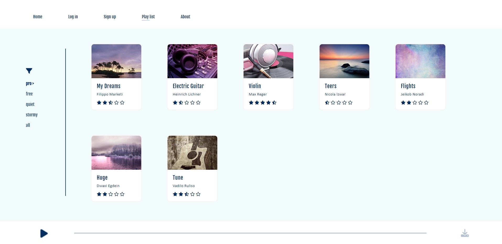

# FEWD_Projects

## Project 1

A static HTML and CSS site, it uses some css tricks to give the user a dynamic site feel.

*screenshots*

## Project 2

Blokus strategy game - vanilla js. Can you be smarter than the computer?

*screenshot*

## Project 3

A Single Page Application of contacts database. Implementation of simulated server which can handle fake Ajax requests.

*screenshot*

## Project 4

Get to 100 - A simple math game. implemented using react.

## Project 5

A site which allows the user to interact with data taken from the server.

*screenshot*

